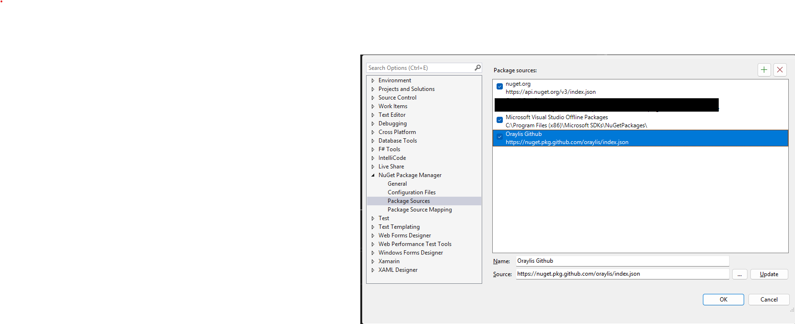

# datam8-plugin-base
Basis Classes for DataM8 Plugin development provided as a nuget Package or dll.

## Publishing
The publishing process is currently very simply and does not automatically
publish the correct nuget version.
When the version in the `.csproj` is updated it needs to be done manully in
the publish workflow too.

## Usage
A new package source needs to be defined to use this package directly from github.
This can be done in multiple ways. In all cases Github requires a PAT to access
the nuget package endpoint.

ORAYLIS nuget package endpoint: __https://nuget.pkg.github.com/oraylis/index.json__

[github nuget registry authentication](https://docs.github.com/en/packages/working-with-a-github-packages-registry/working-with-the-nuget-registry#authenticating-to-github-packages)

### Visual Studio

Nuget registries can be configured within the visual studio settings.



### dotnet CLI

```pwsh
# pwsh
dotnet nuget add source `
    --username USERNAME `
    --password GITHUB_TOKEN `
    --name github "https://nuget.pkg.github.com/oraylis/index.json"
```

